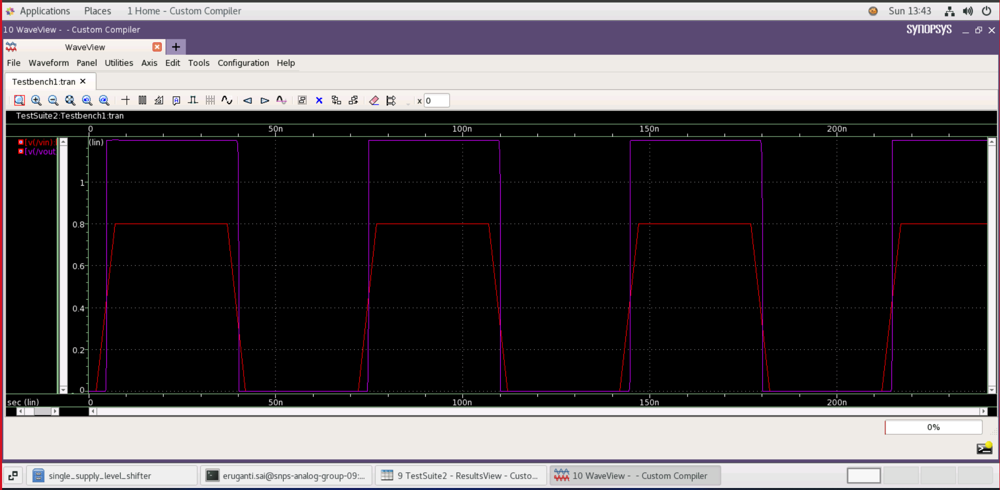

# single_supply_level_shifter
The purpose of this Hackathon is to implement the proposed design in 28 nm PDK (Process Design Kit) suing CMOS technology.

 As a result of literature survey and Implemantation, this is a final Report Submission for successful completion of Latch-based-Integrated-Clock-Gating-Cell design and simulation, for [Cloud Based Analog IC Design Hackathon](https://www.iith.ac.in/events/2022/02/15/Cloud-Based-Analog-IC-Design-Hackathon/)

## Table of Contents
1. [Introduction](#introduction)
2. [Working](#working)
3. [Reference Circuit](#reference-circuit)
4. [Implementation](#implementation)
5. [Schematic Netlist](#schematic-netlist)
6. [Simulation result](#simulation-result)
7. [Challenge](#challenge)
8. [Limitations](#limitations)
9. [References](#references)
10. [Acknowledgements](#acknowledgements)
11. [Author](#author)

## Introduction
Because of the quadratic dependence of power dissipation on supply voltage in digital LSIs, lowering their supply voltage is the most effective and direct technique to reduce power dissipation . A level shifter is a circuit that connects a low core voltage to a high input-output voltage. Dissipation of power in Dynamic and static power dissipation are both present in VLSI circuits. The main cause of dynamic power dissipation is The load capacitor is charged and discharged.The leakage current through each VLSI circuit determines the static power, which can be minimised by scaling supply voltage and capacitance  Understanding the appropriateness of circuits and picking the best topology is a critical factor for any application. The single supply level shifter employing cadence synopsys tool 32nm technology, The circuits will be designed using simulation.

## Working
Shifter for a single supply level To transform a low voltage signal to a higher voltage, a single level shifter with only one supply VDDH has been proposed. The input inverter receives a virtual VDDL from the threshold drop over the NMOS MN1. The output stage is a half latch that prevents leaking by pulling up the inverter's input to VDDH. The main goal of the schematic layout of a single supply level shifter is to extract a lower level from the input signal when it is high (VDDH), which indicates that MN2 is turned on and the output is pulled to VSS. MN1 will rise above VDDH, and MN3 will be turned off.
As a result, if the input is VDDL, the output will be VDDH.

<p align="center">
	 
	<h5 align="center">Figure 1: level_shifter </h5>
</p>
Without adding an extra supply pin, the single supply level shifter facilitates communication between modules.In terms of pin count, routing congestion, and total system cost, single supply level shifters outperform dual supply level shifters. Another advantage of employing a single supply is the flexibility in physical design placement and routing. When the input supply level is lower or VddH is greater than the input supply level by more than the threshold voltage, single supply level shifters expend more leakage power due to increased leakage currents.

## Reference Circuit

<p align="center">
	 
	<h5 align="center">Figure 2: level schematic</h5>
</p>

<p align="center">
	 
	<h5 align="center">Figure 3:  schematic</h5>
	</p>

## Implementation


## Schematic Netlist

The final netlist is as follows:
```

*  Generated for: PrimeSim
*  Design library name: single_supply_level_shifter
*  Design cell name: level_shifter_tb
*  Design view name: schematic
.lib 'saed32nm.lib' TT

*Custom Compiler Version S-2021.09
*Sun Feb 27 14:26:20 2022

.global gnd!
********************************************************************************
* Library          : single_supply_level_shifter
* Cell             : level_shifter_ckt
* View             : schematic
* View Search List : hspice hspiceD schematic spice veriloga
* View Stop List   : hspice hspiceD
********************************************************************************
.subckt level_shifter_ckt out vdd vin vss
xm2 net23 out vdd vdd p105 w=0.1u l=0.03u nf=1 m=1
xm1 out net20 vdd vdd p105 w=0.1u l=0.03u nf=1 m=1
xm0 net20 vin net23 net23 p105 w=0.1u l=0.03u nf=1 m=1
xm5 vdd vdd net23 net23 n105 w=0.1u l=0.03u nf=1 m=1
xm4 out net20 vss vss n105 w=0.1u l=0.03u nf=1 m=1
xm3 net20 vin vss vss n105 w=0.1u l=0.03u nf=1 m=1
.ends level_shifter_ckt

********************************************************************************
* Library          : single_supply_level_shifter
* Cell             : level_shifter_tb
* View             : schematic
* View Search List : hspice hspiceD schematic spice veriloga
* View Stop List   : hspice hspiceD
********************************************************************************
xi7 vout net13 vin gnd! level_shifter_ckt
v3 net13 gnd! dc=1.2
v4 vin gnd! dc=0 pulse ( 0 0.8 2n 5n 5n 30n 70n )
c6 vout gnd! c=0.1f


.tran '20n' '240n' name=tran

.option primesim_remove_probe_prefix = 0
.probe v(*) i(*) level=1
.probe tran v(vin) v(vout)

.temp 25


.option primesim_output=wdf

.option parhier = LOCAL

.end
```
- Netlist is generated by using Custom Compiler.


## Simulation result

- Custom Compiler Waveform

### Transient Analysis:
After creating and saving the schematic go to 'Tools' and open 'Primewave' to start the simulation. In the Primewave select the 'model file' i.e the '28nm PDK's .lib file presentin the HSPICE folder. After this select the 'tran' analysis in the analysis window and give the 'Start', 'Stop', and 'Step Size' parameters and save it. Then add the outputs which needs to be plotted by selecting the nets on the schematic.
One other thing we need to keep in mind is that here we have loop for which an initial condition needs to be declared. For that, we have to go to 'Setup -> Convergance aids' and select the net for which we want to set an initial condition.Then go to 'Simulations -> Netlist and Run' to generate a netlist and run the simulation to get the below output.

<p align="center">
	 
	<h5 align="center">Figure 9: Waveform</h5>
</p>.

## Challenge
- The real challange is to adjust W/L ratio of pMos and nMos such that both have approximately equal rise and fall time.


## References

- [1] https://www.iosrjournals.org/iosr-jvlsi/papers/vol6-
issue2/Version-1/N0602017378.pdf
[2]https://semiengineering.com/knowledge_centers/lowpower/techniques/level-shifters-2

## Acknowledgements

- [Kunal Ghosh](https://github.com/kunalg123), Founder, VSD Corp. Pvt. Ltd
- [Indian Institute Of Technology (IIT), Hyderabad](https://iith.ac.in/)
- [Synopsys](https://www.synopsys.com/)

## Author

[Eruganti saikiran](https://github.com/eruganti),Bachelor of Technology in Electronics and Communication Engineering
